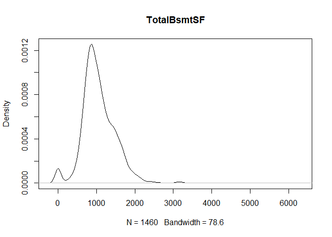
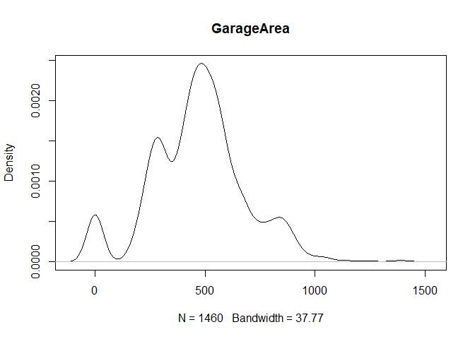
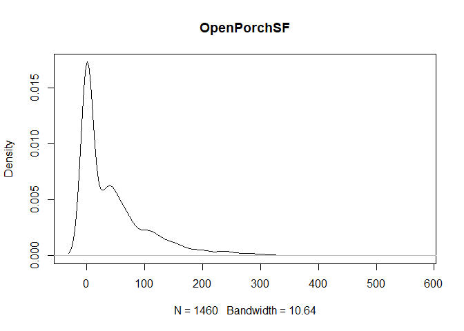
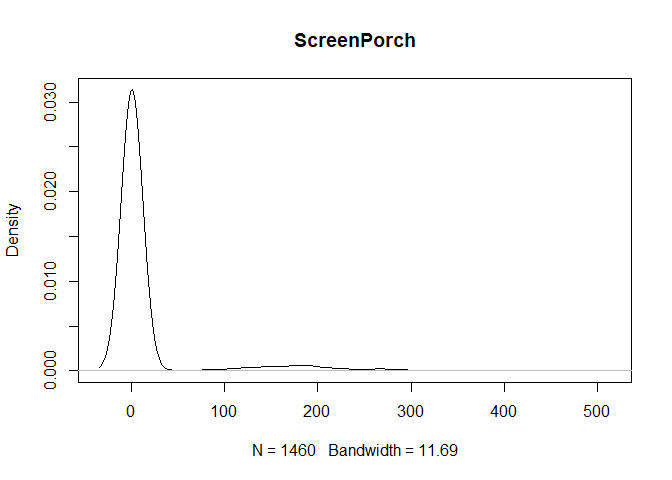

Predicting Housing Prices (Kaggle)
================
Written by: Javier Ng

Introduction
------------

With 79 explanatory variables describing (almost) every aspect of residential homes in Ames, Iowa, this Kaggle competition challenges you to predict the final price of each home. This is an excellent opportunity to test out your feature engineering, RFs and gradient boosting techniques.

Data
----

You can download the dataset from the *Data* folder, `train.csv` and `test.csv`. Below are the file descriptions.

-   train.csv - the training set
-   test.csv - the test set
-   data\_description.txt - full description of each column, originally prepared by Dean De Cock but lightly edited to match the column names used here
-   sample\_submission.csv - a benchmark submission from a linear regression on year and month of sale, lot square footage, and number of bedrooms

### Data fields

Here's a brief version of what you'll find in the data description file.

-   SalePrice - the property's sale price in dollars. This is the target variable that you're trying to predict.
-   MSSubClass: The building class
-   MSZoning: The general zoning classification
-   LotFrontage: Linear feet of street connected to property
-   LotArea: Lot size in square feet
-   Street: Type of road access
-   Alley: Type of alley access
-   LotShape: General shape of property
-   LandContour: Flatness of the property
-   Utilities: Type of utilities available
-   LotConfig: Lot configuration
-   LandSlope: Slope of property
-   Neighborhood: Physical locations within Ames city limits
-   Condition1: Proximity to main road or railroad
-   Condition2: Proximity to main road or railroad (if a second is present)
-   BldgType: Type of dwelling
-   HouseStyle: Style of dwelling
-   OverallQual: Overall material and finish quality
-   OverallCond: Overall condition rating
-   YearBuilt: Original construction date
-   YearRemodAdd: Remodel date
-   RoofStyle: Type of roof
-   RoofMatl: Roof material
-   Exterior1st: Exterior covering on house
-   Exterior2nd: Exterior covering on house (if more than one material)
-   MasVnrType: Masonry veneer type
-   MasVnrArea: Masonry veneer area in square feet
-   ExterQual: Exterior material quality
-   ExterCond: Present condition of the material on the exterior
-   Foundation: Type of foundation
-   BsmtQual: Height of the basement
-   BsmtCond: General condition of the basement
-   BsmtExposure: Walkout or garden level basement walls
-   BsmtFinType1: Quality of basement finished area
-   BsmtFinSF1: Type 1 finished square feet
-   BsmtFinType2: Quality of second finished area (if present)
-   BsmtFinSF2: Type 2 finished square feet
-   BsmtUnfSF: Unfinished square feet of basement area
-   TotalBsmtSF: Total square feet of basement area
-   Heating: Type of heating
-   HeatingQC: Heating quality and condition
-   CentralAir: Central air conditioning
-   Electrical: Electrical system
-   1stFlrSF: First Floor square feet
-   2ndFlrSF: Second floor square feet
-   LowQualFinSF: Low quality finished square feet (all floors)
-   GrLivArea: Above grade (ground) living area square feet
-   BsmtFullBath: Basement full bathrooms
-   BsmtHalfBath: Basement half bathrooms
-   FullBath: Full bathrooms above grade
-   HalfBath: Half baths above grade
-   Bedroom: Number of bedrooms above basement level
-   Kitchen: Number of kitchens
-   KitchenQual: Kitchen quality
-   TotRmsAbvGrd: Total rooms above grade (does not include bathrooms)
-   Functional: Home functionality rating
-   Fireplaces: Number of fireplaces
-   FireplaceQu: Fireplace quality
-   GarageType: Garage location
-   GarageYrBlt: Year garage was built
-   GarageFinish: Interior finish of the garage
-   GarageCars: Size of garage in car capacity
-   GarageArea: Size of garage in square feet
-   GarageQual: Garage quality
-   GarageCond: Garage condition
-   PavedDrive: Paved driveway
-   WoodDeckSF: Wood deck area in square feet
-   OpenPorchSF: Open porch area in square feet
-   EnclosedPorch: Enclosed porch area in square feet
-   3SsnPorch: Three season porch area in square feet
-   ScreenPorch: Screen porch area in square feet
-   PoolArea: Pool area in square feet
-   PoolQC: Pool quality
-   Fence: Fence quality
-   MiscFeature: Miscellaneous feature not covered in other categories
-   MiscVal: $Value of miscellaneous feature
-   MoSold: Month Sold
-   YrSold: Year Sold
-   SaleType: Type of sale
-   SaleCondition: Condition of sale

Loading of Data & Relevant Libraries
------------------------------------

``` r
suppressMessages(library(ggplot2))
suppressMessages(library(naniar))
```

    ## Warning: package 'naniar' was built under R version 3.4.4

``` r
suppressMessages(library(dplyr))
suppressMessages(library(gridExtra))
```

    ## Warning: package 'gridExtra' was built under R version 3.4.4

``` r
train <- read.csv("train.csv", stringsAsFactors = FALSE) #using strings as factors=F cos train and test datasets have different factor numbers for some features
test <- read.csv("test.csv", stringsAsFactors = FALSE)  #missing sale price
```

Data Manipulation
-----------------

``` r
#removing saleprice from train dataset
SalePrice <- train$SalePrice
train <- select(train, -SalePrice)

#combining datasets
full <- rbind(train, test)

#fill NA with missing and convert chr columns to factors
for (col in colnames(full)){ #using for loop
  if (typeof(full[,col]) == "character"){ #if the type of column = character, then we replace NA with missing
    new_col = full[,col]  #obtain the character column
    new_col[is.na(new_col)] = "missing" #replace NA with missing
    full[col] = as.factor(new_col) #change the column to factor
  }
}

#separating train data from full
train <- full[1:nrow(train),] #getting back the rows for train
train <- cbind(train, SalePrice)#combining the sale price back to train
test <- full[(nrow(train)+1):(nrow(full)),]
```

Handling of Missing Data
------------------------

Missing data is visualized using the `naniar` library and replaced with the integer, -1.

``` r
#Visualizing missing data
gg_miss_var(train, show_pct = F) + labs("Missing")
```


``` r
gg_miss_var(test, show_pct = F) + labs("Missing")
```


``` r
#replacing NA values under integer type col with -1
train[is.na(train)] <- -1
test[is.na(test)] <- -1
```

Exploratory Data Analysis
-------------------------

``` r
#EDA - trying to see a relationship between property size/area with sale price
p1 <- ggplot(train, aes(GrLivArea, SalePrice)) + geom_point(alpha = 0.5, color = 'blue') + theme_bw()
p2 <- ggplot(train, aes(LotArea, SalePrice)) + geom_point(alpha = 0.5,color = 'green') + theme_bw()
p3 <- ggplot(train, aes(LotFrontage, SalePrice)) + geom_point(alpha = 0.5,color = 'red') + theme_bw()
p4 <- ggplot(train, aes(GarageArea, SalePrice)) + geom_point(alpha = 0.5,color = 'gray') + theme_bw()
grid.arrange(p1, p2, p3, p4, ncol=2)
```


``` r
ggplot(train, aes(GrLivArea, SalePrice)) + geom_point(aes(color = Neighborhood), alpha=0.5) + 
  scale_x_continuous("GrLivArea") +
  scale_y_continuous("SalePrice") +
  theme_bw() + facet_wrap( ~ Neighborhood) + theme(legend.position="none")
```


``` r
#----------Identifying highly correlated predictors with SalePrice----------#
for (col in colnames(train)){ #start of loop function btw each column
  if(is.numeric(train[,col])){ #identify if the column is numeric, else ignore
    if( abs(cor(train[,col],train$SalePrice)) > 0.5){ #if the absolute number (i.e. numeric) of the correlation btw each col vs SalePrice > 0.5
      print(col) #print out the name of the column if the correlation no. is > 0.5
      print( cor(train[,col],train$SalePrice) ) #print out the correlation value
    }
  }
}
```

    ## [1] "OverallQual"
    ## [1] 0.7909816
    ## [1] "YearBuilt"
    ## [1] 0.5228973
    ## [1] "YearRemodAdd"
    ## [1] 0.507101
    ## [1] "TotalBsmtSF"
    ## [1] 0.6135806
    ## [1] "X1stFlrSF"
    ## [1] 0.6058522
    ## [1] "GrLivArea"
    ## [1] 0.7086245
    ## [1] "FullBath"
    ## [1] 0.5606638
    ## [1] "TotRmsAbvGrd"
    ## [1] 0.5337232
    ## [1] "GarageCars"
    ## [1] 0.6404092
    ## [1] "GarageArea"
    ## [1] 0.6234314
    ## [1] "SalePrice"
    ## [1] 1

``` r
#----------Identifying lowly correlated predictors with SalePrice----------#
for (col in colnames(train)){ #start of loop function btw each column
  if(is.numeric(train[,col])){ #identify if the column is numeric, else ignore
    if( abs(cor(train[,col],train$SalePrice)) < 0.1){ #if the absolute number (i.e. numeric) of the correlation btw each col vs SalePrice > 0.5
      print(col) #print out the name of the column if the correlation no. is < 0.1
      print( cor(train[,col],train$SalePrice) ) #print out the correlation value
    }
  }
}
```

    ## [1] "Id"
    ## [1] -0.02191672
    ## [1] "MSSubClass"
    ## [1] -0.08428414
    ## [1] "OverallCond"
    ## [1] -0.07785589
    ## [1] "BsmtFinSF2"
    ## [1] -0.01137812
    ## [1] "LowQualFinSF"
    ## [1] -0.02560613
    ## [1] "BsmtHalfBath"
    ## [1] -0.01684415
    ## [1] "X3SsnPorch"
    ## [1] 0.04458367
    ## [1] "PoolArea"
    ## [1] 0.09240355
    ## [1] "MiscVal"
    ## [1] -0.02118958
    ## [1] "MoSold"
    ## [1] 0.04643225
    ## [1] "YrSold"
    ## [1] -0.02892259

``` r
#----------Identifying if the features are correlated to each other-------#
cors = cor(train[ , sapply(train, is.numeric)]) #shows a correlation matrix
high_cor = which(abs(cors) > 0.6 & (abs(cors) < 1)) #identify the positions of high correlation features, counting from col down!
rows = rownames(cors)[((high_cor-1) %/% 38)+1] # %/% = integer division i.e. 5 %/% 2 = 2/ 38 BECAUSE it has 38 col & rows!
cols = colnames(cors)[ifelse(high_cor %% 38 == 0, 38, high_cor %% 38)] #modulus (x mod y) 5%%2 = 1 
vals = cors[high_cor]

cor_data = data.frame(cols=cols, rows=rows, correlation=vals)
cor_data #as none of them are >0.9, we dont have to remove any features
```

    ##            cols         rows correlation
    ## 1    GarageCars  OverallQual   0.6006707
    ## 2     SalePrice  OverallQual   0.7909816
    ## 3  BsmtFullBath   BsmtFinSF1   0.6492118
    ## 4     X1stFlrSF  TotalBsmtSF   0.8195300
    ## 5     SalePrice  TotalBsmtSF   0.6135806
    ## 6   TotalBsmtSF    X1stFlrSF   0.8195300
    ## 7     SalePrice    X1stFlrSF   0.6058522
    ## 8     GrLivArea    X2ndFlrSF   0.6875011
    ## 9      HalfBath    X2ndFlrSF   0.6097073
    ## 10 TotRmsAbvGrd    X2ndFlrSF   0.6164226
    ## 11    X2ndFlrSF    GrLivArea   0.6875011
    ## 12     FullBath    GrLivArea   0.6300116
    ## 13 TotRmsAbvGrd    GrLivArea   0.8254894
    ## 14    SalePrice    GrLivArea   0.7086245
    ## 15   BsmtFinSF1 BsmtFullBath   0.6492118
    ## 16    GrLivArea     FullBath   0.6300116
    ## 17    X2ndFlrSF     HalfBath   0.6097073
    ## 18 TotRmsAbvGrd BedroomAbvGr   0.6766199
    ## 19    X2ndFlrSF TotRmsAbvGrd   0.6164226
    ## 20    GrLivArea TotRmsAbvGrd   0.8254894
    ## 21 BedroomAbvGr TotRmsAbvGrd   0.6766199
    ## 22  OverallQual   GarageCars   0.6006707
    ## 23   GarageArea   GarageCars   0.8824754
    ## 24    SalePrice   GarageCars   0.6404092
    ## 25   GarageCars   GarageArea   0.8824754
    ## 26    SalePrice   GarageArea   0.6234314
    ## 27  OverallQual    SalePrice   0.7909816
    ## 28  TotalBsmtSF    SalePrice   0.6135806
    ## 29    X1stFlrSF    SalePrice   0.6058522
    ## 30    GrLivArea    SalePrice   0.7086245
    ## 31   GarageCars    SalePrice   0.6404092
    ## 32   GarageArea    SalePrice   0.6234314

``` r
library(corrplot) 
```

    ## Warning: package 'corrplot' was built under R version 3.4.4

    ## corrplot 0.84 loaded

``` r
corrplot(cors) #visualize correlation
```


``` r
#------Identify outliers for numeric cols-----#
for (col in colnames(train)){
  if(is.numeric(train[,col])){
    plot(density(train[,col]), main=col)
  }
} #data shows that spring and summer sells more houses than winter, and that salepx is right skewed, meaning some houses sell higher than avg
```



Data Transformation after EDA
-----------------------------

``` r
# Add variable that combines above grade living area with basement sq footage
train$total_sq_footage = train$GrLivArea + train$TotalBsmtSF
test$total_sq_footage = test$GrLivArea + test$TotalBsmtSF

# Add variable that combines above ground and basement full and half baths
train$total_baths = train$BsmtFullBath + train$FullBath + (0.5 * (train$BsmtHalfBath + train$HalfBath))
test$total_baths = test$BsmtFullBath + test$FullBath + (0.5 * (test$BsmtHalfBath + test$HalfBath))

#removing IDs
train <- select(train, -Id)
test <- select(test, -Id)
```

Model Development
-----------------

This is the main aspect of this kaggle competition. I will be using gradient boosted trees, XGBoost, for the model building. There will be tuning parameters as well.

``` r
library(caret)
```

    ## Warning: package 'caret' was built under R version 3.4.4

    ## Loading required package: lattice

``` r
library(Metrics)
```

    ## Warning: package 'Metrics' was built under R version 3.4.4

``` r
library(xgboost)
```

    ## Warning: package 'xgboost' was built under R version 3.4.4

    ## 
    ## Attaching package: 'xgboost'

    ## The following object is masked from 'package:dplyr':
    ## 
    ##     slice

``` r
# Create custom summary function in proper format for caret
custom_summary <- function(data, lev = NULL, model = NULL){
  out = rmsle(data[, "obs"], data[, "pred"])
  names(out) = c("rmsle")
  out
}

# Create control object
control <- trainControl(method = "cv",  # Use cross validation
                       number = 5,     # 5-folds
                       summaryFunction = custom_summary                      
)


# Create grid of tuning parameters
grid <- expand.grid(nrounds=c(100, 200, 400, 800), # Test 4 values for boosting rounds
                    max_depth= c(4, 6),           # Test 3 values for tree depth
                    eta=c(0.1, 0.05, 0.025),      # Test 3 values for learning rate: 0.1, 0.05, 0.025
                    gamma= c(0.1),                #https://xgboost.readthedocs.io/en/latest/parameter.html for explanation
                    colsample_bytree = c(1), 
                    min_child_weight = c(1),
                    subsample = c(1))

#training and development of model

xgb_tree_model <- train(SalePrice~.,      # Predict SalePrice using all features
                        data=train,
                        method="xgbTree",
                        trControl=control, #for cross validation w control
                        tuneGrid=grid, 
                        metric="rmsle",     # Use custom performance metric
                        maximize = FALSE)   # Minimize the metric
```

Analysis of Model
-----------------

``` r
#Analysis of results
xgb_tree_model$bestTune #tells us the best model, is a tree with depth 4, trained 400 rounds w learning rate 0.1 (eta)
```

    ##   nrounds max_depth   eta gamma colsample_bytree min_child_weight
    ## 4     800         4 0.025   0.1                1                1
    ##   subsample
    ## 4         1

``` r
xgb_tree_model$results #find the RMSLE from the above model here: RMSLE = 0.1327114; the lower the better!
```

    ##      eta max_depth gamma colsample_bytree min_child_weight subsample
    ## 1  0.025         4   0.1                1                1         1
    ## 9  0.050         4   0.1                1                1         1
    ## 17 0.100         4   0.1                1                1         1
    ## 5  0.025         6   0.1                1                1         1
    ## 13 0.050         6   0.1                1                1         1
    ## 21 0.100         6   0.1                1                1         1
    ## 2  0.025         4   0.1                1                1         1
    ## 10 0.050         4   0.1                1                1         1
    ## 18 0.100         4   0.1                1                1         1
    ## 6  0.025         6   0.1                1                1         1
    ## 14 0.050         6   0.1                1                1         1
    ## 22 0.100         6   0.1                1                1         1
    ## 3  0.025         4   0.1                1                1         1
    ## 11 0.050         4   0.1                1                1         1
    ## 19 0.100         4   0.1                1                1         1
    ## 7  0.025         6   0.1                1                1         1
    ## 15 0.050         6   0.1                1                1         1
    ## 23 0.100         6   0.1                1                1         1
    ## 4  0.025         4   0.1                1                1         1
    ## 12 0.050         4   0.1                1                1         1
    ## 20 0.100         4   0.1                1                1         1
    ## 8  0.025         6   0.1                1                1         1
    ## 16 0.050         6   0.1                1                1         1
    ## 24 0.100         6   0.1                1                1         1
    ##    nrounds     rmsle    rmsleSD
    ## 1      100 0.1603772 0.01366649
    ## 9      100 0.1335609 0.01611432
    ## 17     100 0.1288234 0.01514207
    ## 5      100 0.1600550 0.01352465
    ## 13     100 0.1335101 0.01512673
    ## 21     100 0.1319013 0.01659683
    ## 2      200 0.1332782 0.01544445
    ## 10     200 0.1283106 0.01601184
    ## 18     200 0.1282649 0.01518063
    ## 6      200 0.1341677 0.01530090
    ## 14     200 0.1304605 0.01646476
    ## 22     200 0.1315864 0.01717607
    ## 3      400 0.1274373 0.01535594
    ## 11     400 0.1270630 0.01562608
    ## 19     400 0.1289407 0.01491713
    ## 7      400 0.1313435 0.01664478
    ## 15     400 0.1299127 0.01672371
    ## 23     400 0.1317310 0.01725485
    ## 4      800 0.1265917 0.01536635
    ## 12     800 0.1272017 0.01610431
    ## 20     800 0.1290336 0.01478126
    ## 8      800 0.1310821 0.01670152
    ## 16     800 0.1297831 0.01677597
    ## 24     800 0.1318120 0.01728210

``` r
varImp(xgb_tree_model) #identify which predictors are most impt to the model
```

    ## xgbTree variable importance
    ## 
    ##   only 20 most important variables shown (out of 270)
    ## 
    ##                      Overall
    ## OverallQual         100.0000
    ## total_sq_footage     89.3618
    ## total_baths           6.6701
    ## YearBuilt             5.5404
    ## LotArea               3.9323
    ## BsmtFinSF1            3.3930
    ## X2ndFlrSF             3.2530
    ## GarageCars            2.8897
    ## YearRemodAdd          2.7266
    ## GrLivArea             2.2998
    ## GarageArea            1.9245
    ## OverallCond           1.7977
    ## Fireplaces            1.4501
    ## TotalBsmtSF           1.2327
    ## NeighborhoodEdwards   1.1427
    ## LotFrontage           1.0158
    ## KitchenQualTA         0.9489
    ## GarageYrBlt           0.7664
    ## BsmtUnfSF             0.6924
    ## KitchenAbvGr          0.6616

Model Testing
-------------

``` r
test_predictions <- predict(xgb_tree_model, newdata=test)
```

Submission to Kaggle
--------------------

``` r
submission <- read.csv("sample_submission.csv")
submission$SalePrice <- test_predictions
head(submission)
```

    ##     Id SalePrice
    ## 1 1461  127097.6
    ## 2 1462  162872.7
    ## 3 1463  185697.5
    ## 4 1464  187500.6
    ## 5 1465  187619.8
    ## 6 1466  177523.4
